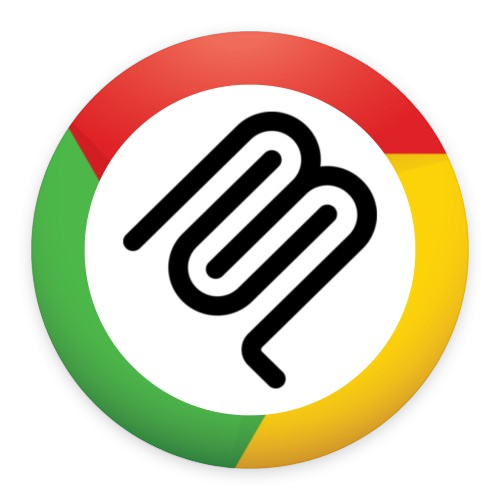

<p align="center">
  
</p>

<h1 align="center">Chrome MCP</h1>

<p align="center">
  MCP server that gives AI access to your <strong>real Chrome tabs</strong> — no extra browser, no DevTools session.
</p>

<p align="center">
  <a href="#quick-start">Quick Start</a> ·
  <a href="#mcp-tools">Tools</a> ·
  <a href="#how-it-works">How it Works</a> ·
  <a href="LICENSE">MIT License</a>
</p>

---

An [MCP](https://modelcontextprotocol.io) server + Chrome extension that exposes your **existing browser profile** — open tabs, cookies, session state — to any MCP client (Cursor, Claude Desktop, etc.). Compared with tooling that launches a separate Chrome or DevTools session, this stack **reuses whatever is already open** in the browser you use day to day.

## Quick Start

```bash
git clone https://github.com/DeepakSilaych/chrome-mcp.git
cd chrome-mcp
npm install
npm run build
```

### Load the extension

1. Open `chrome://extensions` → enable **Developer mode**.
2. **Load unpacked** → select the `extension/` folder.

### Add to Cursor

**Option A — npx (no clone needed)**

```json
{
  "mcpServers": {
    "chrome-mcp": {
      "command": "npx",
      "args": ["-y", "mcp-real-chrome"]
    }
  }
}
```

**Option B — from source**

```json
{
  "mcpServers": {
    "chrome-mcp": {
      "command": "node",
      "args": ["/absolute/path/to/chrome-mcp/server/dist/index.js"]
    }
  }
}
```

### Connect

1. Enable the MCP server in Cursor (it starts the node process).
2. Click the extension icon in Chrome → **Connect**.
3. Ask the LLM to `list_tabs` — you should see your real tabs.

## MCP Tools

| Category | Tools | Description |
|----------|-------|-------------|
| **Tabs** | `list_tabs` `get_active_tab` `switch_tab` `close_tab` `create_tab` | Manage open tabs |
| **Content** | `get_page_content` `get_selected_text` | Read page text / HTML / selection |
| **Screenshot** | `take_screenshot` | Capture visible tab as PNG |
| **Navigate** | `navigate_to` `go_back` `go_forward` `reload_tab` | Browser navigation |
| **Network** | `start_network_capture` `stop_network_capture` `get_captured_requests` | Record HTTP traffic via debugger |
| **Console** | `start_console_capture` `stop_console_capture` `get_console_logs` | Capture console output |
| **Interact** | `click_element` `type_text` `fill_form` `scroll_page` | Drive page elements |
| **Storage** | `get_cookies` `get_local_storage` | Read cookies and localStorage |

## How it Works

```
Cursor/LLM  ←—stdio—→  MCP Server  ←—WebSocket—→  Chrome Extension  ←—chrome.*—→  Browser
```

1. **MCP server** (`server/`) runs as a stdio process spawned by the MCP client. It also starts a WebSocket server on `127.0.0.1:17691` (configurable via `CHROME_MCP_PORT`).
2. **Chrome extension** (`extension/`) connects to that WebSocket when you click Connect. Incoming requests carry a UUID; the extension runs the matching `chrome.*` handler and replies with the same UUID.
3. **Shared protocol** (`shared/`) defines action names, request/response types, and guards used by both sides.

## Project Structure

```
chrome-mcp/
├── server/              MCP server (Node.js, stdio transport)
│   └── src/
│       ├── index.ts     Entry point
│       ├── bridge.ts    WebSocket server + request correlation
│       └── tools/       One file per tool category
├── extension/           Chrome MV3 extension
│   ├── manifest.json
│   ├── src/
│   │   ├── background.ts   Service worker (WS client + router)
│   │   ├── handlers/       One file per tool category
│   │   ├── chromeApi.ts    Promisified chrome.* wrappers
│   │   └── debuggerSession.ts  CDP attach for network/console
│   └── popup/           Connection UI + tool call log
├── shared/              Protocol types shared across packages
├── assets/              Logo and icons
└── package.json         npm workspaces root
```

## Configuration

| Variable | Default | Description |
|----------|---------|-------------|
| `CHROME_MCP_PORT` | `17691` | WebSocket port (set on server; match in extension popup) |

## Extension Features

- **Manual connect/disconnect** — no background noise when the server is off.
- **Auto-reconnect** with exponential backoff while connected.
- **Keepalive** pings every 20s to prevent service worker termination.
- **Tool call log** in the popup — shows action, duration, success/error for every call.

## Security

The LLM can read and interact with any tab the extension can access. Avoid using this on profiles with sensitive sessions (banking, health portals, admin panels) unless you understand the risk.

## Troubleshooting

| Problem | Fix |
|---------|-----|
| "Chrome extension not connected to bridge" | Open extension popup → click **Connect**. Verify port matches. |
| Script injection fails | Some pages (`chrome://`, Web Store) block scripting. Use a normal `https://` tab. |
| Network/console capture errors | Only one debugger can attach per tab. Close DevTools or stop other captures first. |
| `EADDRINUSE` on server start | Another process holds the port. Kill it or set a different `CHROME_MCP_PORT`. |

## License

[MIT](LICENSE)
